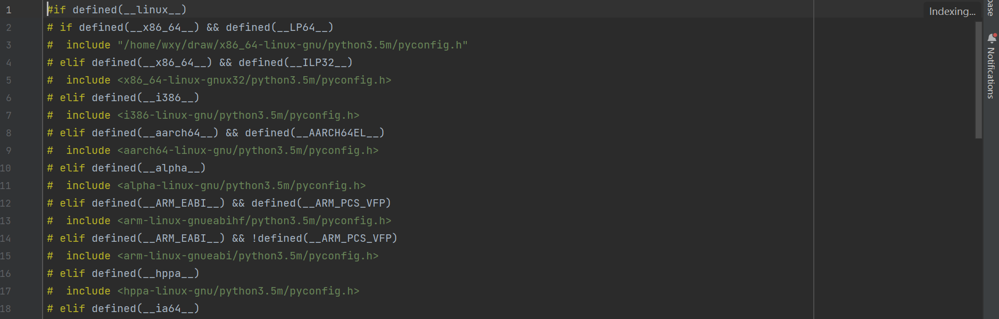
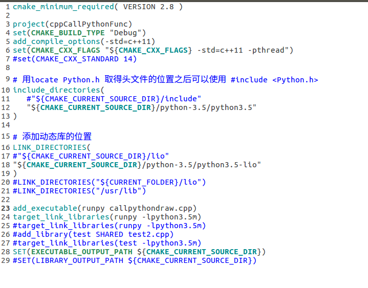
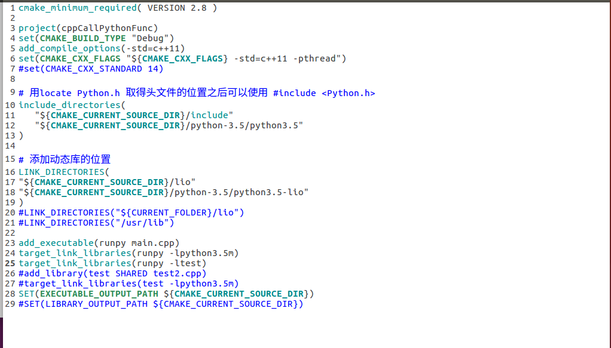

# 1.Prerequisites

Ubuntu 64-bit 16.04

# 2.Clone the repository

**Clone the repository :**

```
git clone https://github.com/SEU-LMD/TXT2PAINT.git
```

**Noted:**

注意在将文件clone到本地后，首先更改/python-3.5/python3.5/pyconfig.h中的文件路径，该文件是去找寻/x86_64-linux-gnu/python3.5m/pyconfig.h这个文件，如图所示的文件路径为:

```
“/home/wxy/draw/x86_64-linux-gnu/python3.5m/pyconfig.h”
```



**Build:**

```
cd TXT2PAINT
mkdir build
cd build
cmake ..
make
```

# 3.Build and Run

## 3.1 Run directly

1.Modify CMakeLists.txt file as shown in the figure to generate an executable file "runpy" by callpythondraw.cpp .



2.Build and Run the executable runpy.

```
mkdir build
cd build
cmake ..
make
cd ..
./runpy
```

## 3.2 Run through the libtest.so file

1.Modify CMakeLists.txt file as shown in the figure to generate an executable file "runpy" by main.cpp .



2.Build and Run the executable runpy

```
mkdir build
cd build
cmake ..
make
cd ..
./runpy
```

